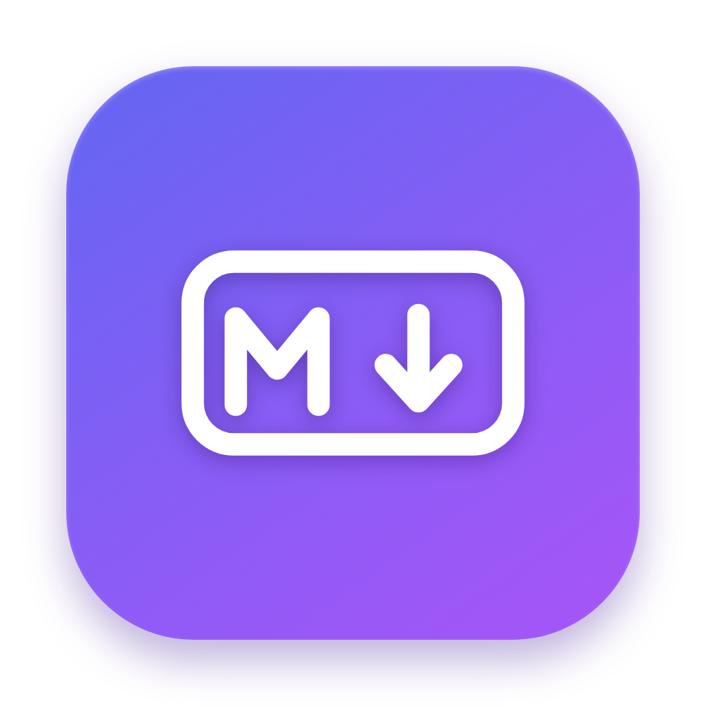
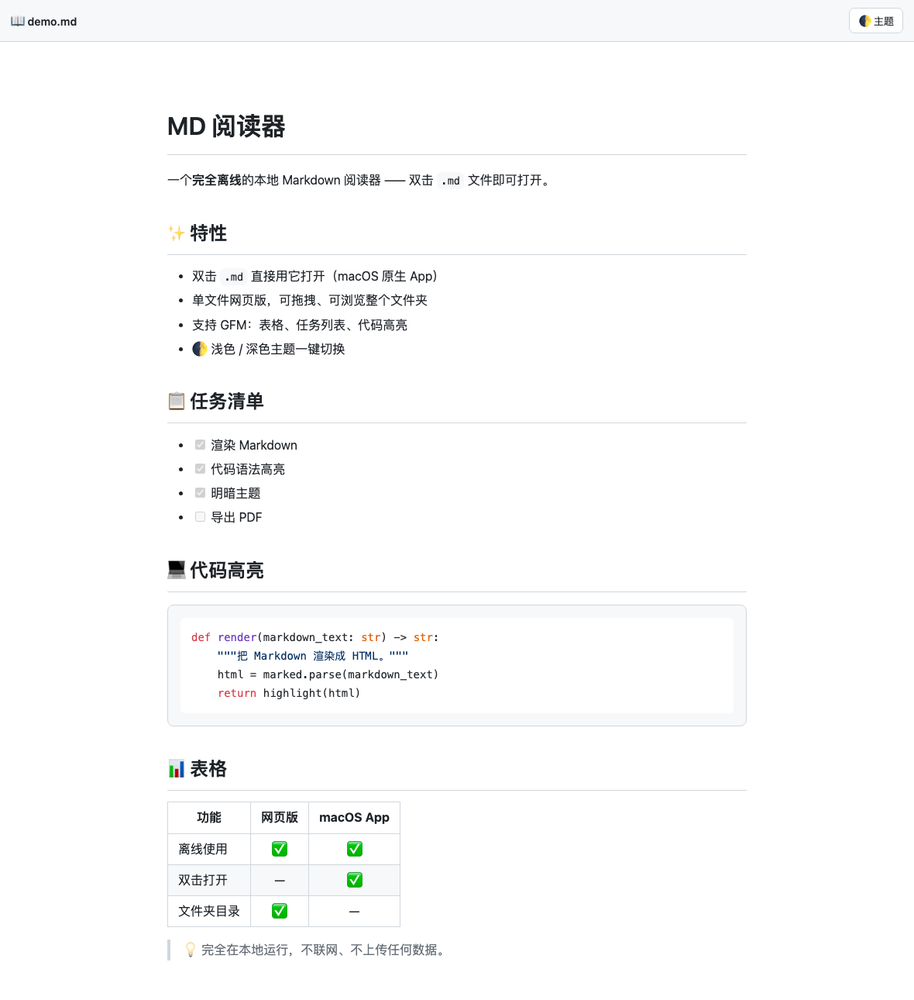
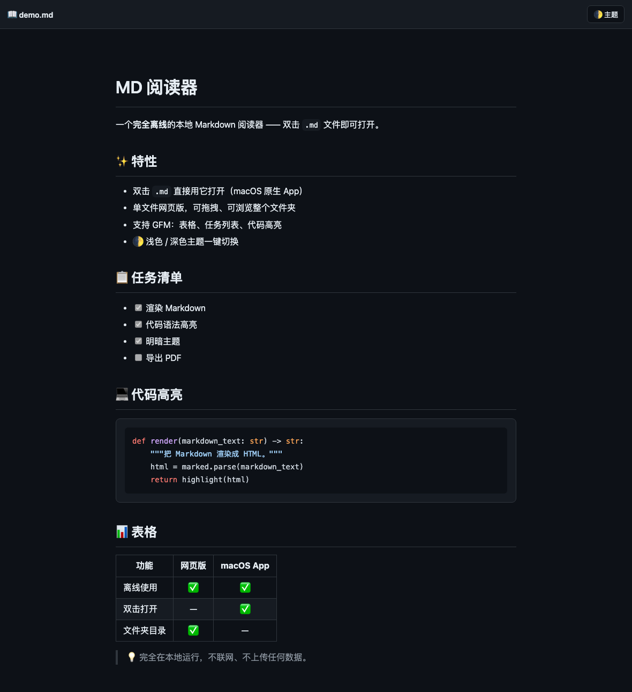

<div align="center">



# MD Reader

A fully **offline** local Markdown reader — double-click any `.md` file to open it.

[中文](README.md) ·
 ·


 

</div>

---

Two ways to use it:

1. **Native macOS app (`MD阅读器.app`)** — double-click any `.md` file to open a nicely rendered page.
2. **Single-file web version (`MD 阅读器.html`)** — open it in any browser; drag & drop a file or open a whole folder (with a file tree).

Rendering is powered by embedded [marked](https://github.com/markedjs/marked) + [highlight.js](https://github.com/highlightjs/highlight.js): GFM tables, task lists, syntax highlighting, and a 🌓 light / dark theme toggle.

## ✨ Features

- Double-click `.md` to open (native macOS app)
- Single-file web version: drag & drop, or browse an entire folder
- GFM: tables, task lists, strikethrough
- Code syntax highlighting (light & dark themes that follow the page)
- 🌓 One-click light/dark theme, remembers your choice
- **Fully offline** — no network, no data collection

---

## Option 1: macOS App (double-click `.md` to open)

### Use the prebuilt app
The repo ships a prebuilt `MD阅读器.app` (also available under [Releases](../../releases)):

1. Drag `MD阅读器.app` into your Applications folder (or anywhere).
2. On first launch, if macOS says "cannot verify the developer": right-click the app → **Open** → confirm once (normal one-time prompt for a self-signed app).
3. To make it the default: right-click any `.md` → **Get Info** → under "Open with" pick `MD阅读器` → **Change All**.

### Set as default handler (CLI, optional)
```bash
brew install duti
for ext in md markdown mdown mkd; do duti -s com.local.mdreader .$ext all; done
```

### Build it yourself
```bash
./build.sh
```
The script compiles `src/main.applescript` with `osacompile`, injects resources and the icon, writes the `Info.plist` document types, signs the bundle, and registers it with Launch Services.

**How it works:** double-click `.md` → Finder invokes the app → the app uses the embedded `render.py` to turn Markdown into a self-contained HTML → opens it in your default browser.

---

## Option 2: Web version (any platform)

Double-click `MD 阅读器.html` to open it in a browser, then:

- Click "打开文件" (Open File) to pick a single `.md`
- Click "打开文件夹" (Open Folder) → a file tree appears on the left
- Or drag a `.md` file into the window

A single HTML file with all libraries embedded — works offline and on any machine (Windows / Linux too).

---

## Project layout

```
.
├── MD阅读器.app/        # Prebuilt macOS app
├── MD 阅读器.html        # Single-file web version
├── build.sh             # Script to build the .app
├── src/
│   ├── main.applescript # App's on open / on run logic
│   ├── render.py        # Markdown → self-contained HTML renderer
│   ├── icon.icns        # App icon
│   └── lib/             # marked / highlight.js / theme styles
├── docs/                # Screenshots & icon
└── 示例.md              # Sample document
```

## Requirements

- macOS (for the app); the web version runs anywhere
- `python3` (used by the app to render; preinstalled on macOS or via Homebrew)
- Build tools `osacompile` and `PlistBuddy` ship with macOS

## Privacy & Security

- Runs entirely locally — **no network, nothing uploaded**, no data collected.
- marked / highlight.js are embedded; no remote resources are requested at runtime.
- The app's `Info.plist` requests **no** system permissions (camera, contacts, photos, etc.).

## License

[MIT](LICENSE)
